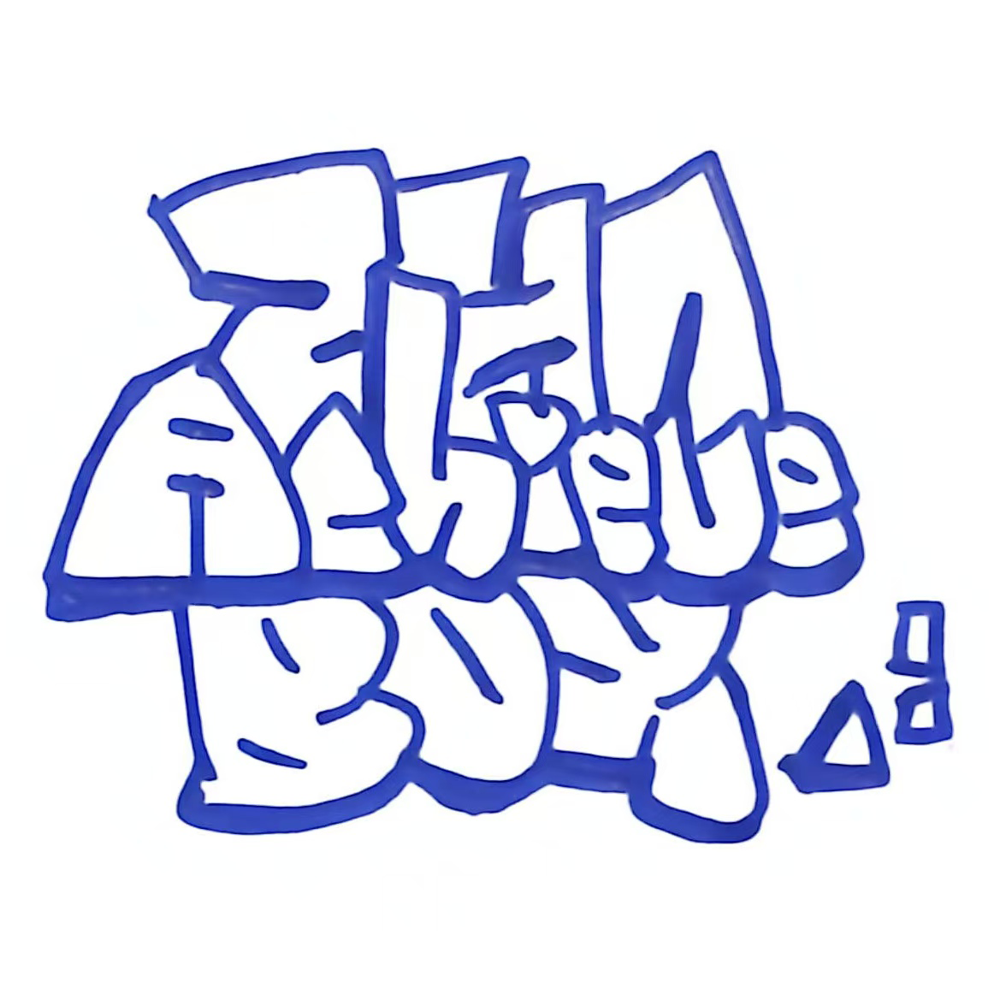

# 🏆 Infi-AchieveBox - 无限成就盒子

一个基于 Web 的个人成就管理系统，帮助你记录、管理和展示你的项目成就。



## ✨ 功能特点

- 📦 **成就仓库管理** - 创建、编辑、删除你的成就项目
- 🎨 **分类管理** - 支持其他、UGUI、动效等多个分类
- ⭐ **难度评级** - 三级难度系统（1-3星），不同难度对应不同奖励
- 💰 **奖励系统** - 金币和钻石奖励机制
- 🖼️ **图片上传** - 为每个成就项目上传封面图片
- 📊 **成就统计** - 实时统计仓库容量和成就数量
- 🌙 **精美UI** - 游戏化界面设计，提供良好的视觉体验

## 📋 系统要求

- **Node.js** >= 14.0.0
- **操作系统**: Windows（推荐）、Linux、macOS
- **浏览器**: 现代浏览器（Chrome、Edge、Firefox 等）

## 🚀 快速开始

### Windows 用户

#### 方法一：使用批处理脚本（推荐）

1. 下载项目到本地
2. 双击运行 `start.bat`
3. 等待自动打开浏览器即可使用

#### 方法二：使用 PowerShell 脚本

1. 下载项目到本地
2. 右键点击 `start.ps1`，选择"使用 PowerShell 运行"
3. 等待自动打开浏览器即可使用

#### 方法三：创建桌面快捷方式

1. 右键点击 `create-shortcut.ps1`，选择"使用 PowerShell 运行"
2. 会在项目根目录生成 `AchievementBox.lnk` 快捷方式
3. 将快捷方式移动到桌面，双击即可启动

### Linux/macOS 用户

1. 确保已安装 Node.js
2. 在项目目录下运行：

```bash
node server.js
```

3. 在浏览器中访问 `http://localhost:8000`

## 📖 使用说明

### 添加成就

1. 点击右下角的 `+` 按钮
2. 填写成就信息：
   - 上传项目图片
   - 输入成就名称
   - 选择项目分类
   - 选择任务难度（⭐ 10金币 / ⭐⭐ 20金币 / ⭐⭐⭐ 1钻石）
   - 输入项目描述（不少于25字）
3. 点击"保存成就"按钮

### 编辑成就

1. 点击已存在的成就盒子
2. 在弹出的编辑窗口中修改信息
3. 点击"保存修改"按钮

### 删除成就

1. 点击已存在的成就盒子
2. 在编辑窗口中点击删除按钮

### 查看成就列表

1. 点击右上角的"🏆 成就"按钮
2. 查看所有已获得的成就

### 切换分类

点击顶部的分类标签（其他、UGUI、动效）切换查看不同分类的成就。

## 📁 项目结构

```
infi-achieveBox/
├── index.html              # 主页面
├── style.css               # 样式文件
├── script.js               # 前端逻辑
├── server.js               # Node.js 服务器
├── start.bat               # Windows 启动脚本
├── start.ps1               # PowerShell 启动脚本
├── create-shortcut.ps1     # 创建快捷方式脚本
├── asset/                  # 资源目录
│   ├── images/            # 用户上传的图片
│   └── achieve/           # 成就数据（JSON）
├── 256x256.ico             # 应用图标
└── achieveBOX.png          # 应用截图
```

## 🎮 游戏化元素

### 货币系统

- 💰 **金币**: 通过完成1星和2星难度任务获得
- 💎 **钻石**: 通过完成3星难度任务获得

### 难度奖励

| 难度 | 星级 | 奖励 |
|------|------|------|
| 简单 | ⭐ | 10 金币 |
| 中等 | ⭐⭐ | 20 金币 |
| 困难 | ⭐⭐⭐ | 1 钻石 |

### 仓库容量

- 初始容量：24个盒子
- 随着成就增加，仓库容量会自动扩展

## 🔧 技术栈

- **前端**: HTML5, CSS3, JavaScript (ES6+)
- **后端**: Node.js (仅使用内置模块)
- **数据存储**: JSON 文件
- **图片存储**: 本地文件系统

## 📝 数据存储

所有数据存储在本地：

- 成就数据：`asset/achieve/` 目录下的 JSON 文件
- 图片文件：`asset/images/` 目录
- 货币数据：浏览器 localStorage

## 🛠️ 开发说明

### 启动开发服务器

```bash
node server.js
```

服务器将在 `http://localhost:8000` 启动

### API 接口

- `GET /api/projects?category={category}` - 获取指定分类的项目
- `GET /api/all-projects` - 获取所有项目
- `POST /api/projects` - 创建新项目
- `POST /api/projects/delete` - 删除项目
- `POST /api/projects/update` - 更新项目

## 📄 许可证

本项目仅供个人学习和使用。

## 🤝 贡献

欢迎提交 Issue 和 Pull Request！

## 📧 联系方式

- 作者: zhadao
- 邮箱: zhadaolee@outlook.com
- GitHub: https://github.com/zhadao/Infi-AchieveBox

## 🙏 致谢

感谢所有使用和支持本项目的用户！

---

**享受你的成就管理之旅！🎉**
